# Smart Factory: Predictive Maintenance Dashboard

A Data Visualization project designed to monitor, predict, and analyze tool wear and machine failures in a manufacturing environment. 

## 📖 Project Overview
This project consists of two distinct interfaces designed for different operational needs:
1. **Live Dashboard:** A low-fidelity, high-contrast screen focused only on critical, real-time streaming information.
2. **Executive Summary:** A high-fidelity, in-depth static dashboard providing historical context and actionable maintenance reports.

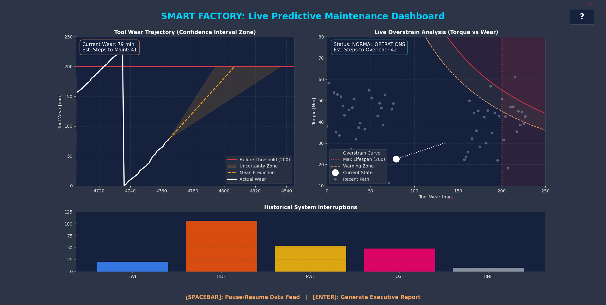

---

## 🎨 Design System & Color Palette
To ensure a seamless user experience, a strict and consistent color language is used across both dashboards.

**General UI Elements:**
*   **White:** Represents the current object state (the "now").
*   **Red:** Signifies the critical failure zone or a broken tool.
*   **Transparent Orange:** Represents an estimation cone or warning area where operators must pay close attention.

**Failure Type Categorization:**
*   🟦 **TWF (Tool Wear):** Dark Blue — *Classic blue-collar mechanical wear.*
*   🟧 **HDF (Heat Dissipation):** Orange — *Signifies dangerous machinery heat.*
*   🟨 **PWF (Power Fault):** Yellow — *Signifies electricity/power surges.*
*   🟪 **OSF (Overstrain):** Pink — *Signifies material discoloration due to extreme mechanical stress.*
*   ⬜ **RNF (Random Failure):** Grey — *Signifies uncertainty or unknown sensor ghosting.*

**Status Indicators (Summary View Specific):**
*   🟩 **Green:** Optimal operations; everything is running smoothly. *(In Swaps: Tool was swapped safely on time).*
*   🟨 **Yellow:** Warning phase; start preparing for maintenance.
*   🟥 **Red:** Critical phase; immediate action required. *(In Swaps: Tool broke before it was swapped).*

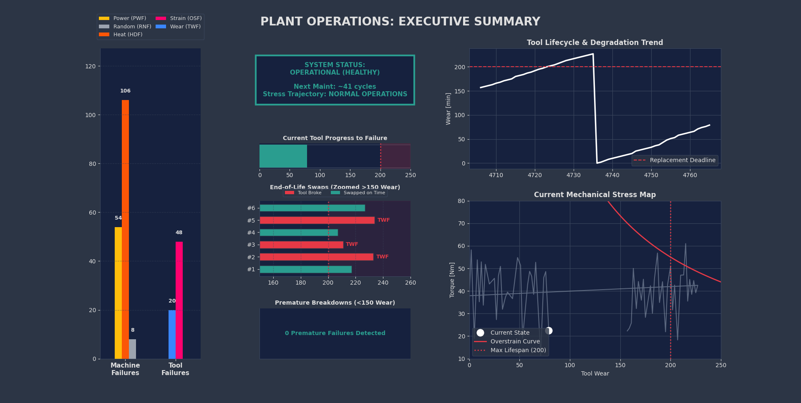

---

## 📡 View 1: Live Dashboard
The Live Dashboard monitors the machine in real-time, focusing only on the data an operator needs at a glance.

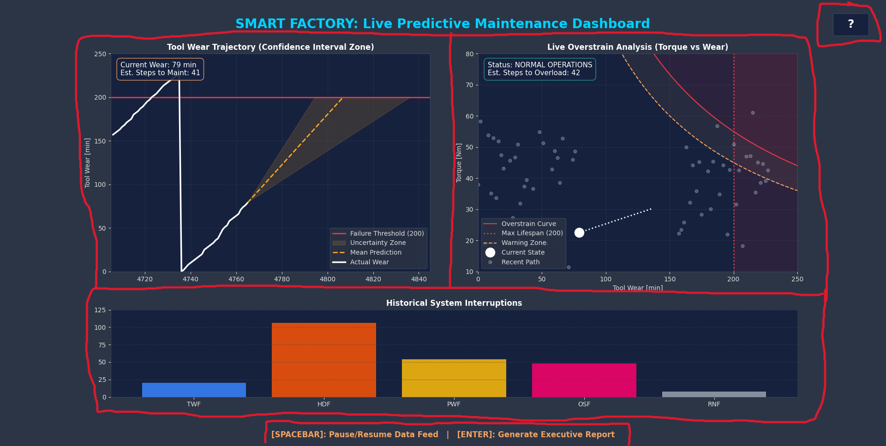

### Core Functionality
The dashboard is split into five distinct functional areas:
1. **Tool Wear Trajectory:** Tracks physical degradation and predicts failure.
2. **Overstrain Analysis:** Maps physical forces against tool age to find dangerous stress thresholds.
3. **Historical Interruptions:** Tracks the frequency of past failure types.
4. **Information Guide (?):** An interactive explanation panel.
5. **Hotkey Controls:** Footer text detailing how to pause the feed `[Spacebar]` or generate a report `[Enter]`.

#### Information Guide
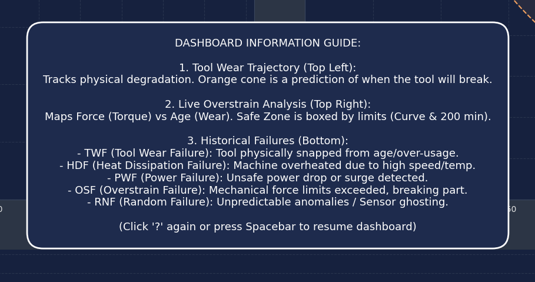
Clicking the `?` button opens a floating, high-contrast panel explaining the dashboard's visual elements, allowing new operators to quickly understand the interface without leaving the screen.

### 📈 Tool Wear Trajectory
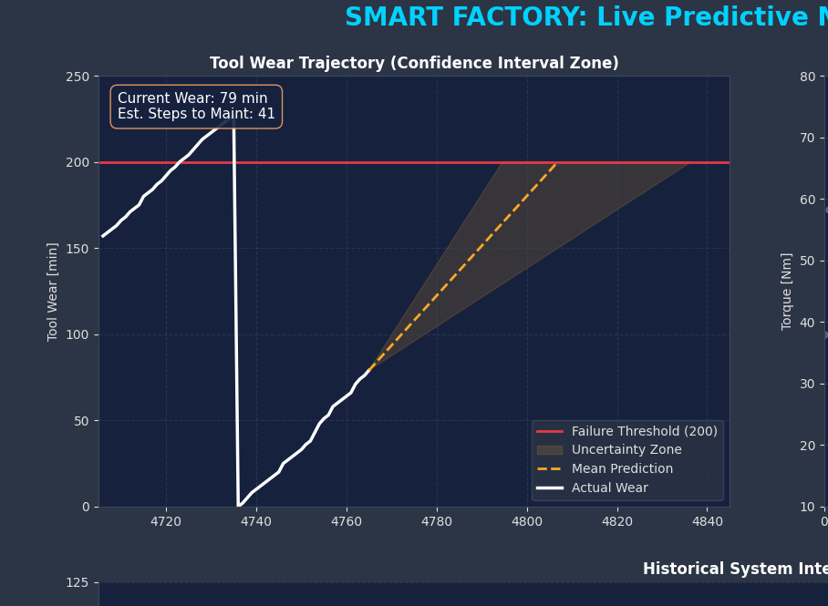
*   **Visual (UX/Layout):** To prevent center-screen clutter, the HUDs (floating info boxes) are anchored to the top-left and bottom-right corners—the furthest points from the central focus area of the chart.
*   **Functional (Data Logic):** 
    *   The **Top HUD** calculates and displays the current state and estimated steps until a swap is needed.
    *   The **Bottom HUD** acts as a dynamic legend. 
    *   The **Failure Threshold** is fixed at the 200-minute mark. 
    *   The **Mean Prediction** (dashed line) is a moving average used to estimate the exact maintenance point, while the **Uncertainty Zone** projects a cone based on raw historical fluctuations to show worst-case and best-case failure scenarios.

### ⚙️ Overstrain Analysis
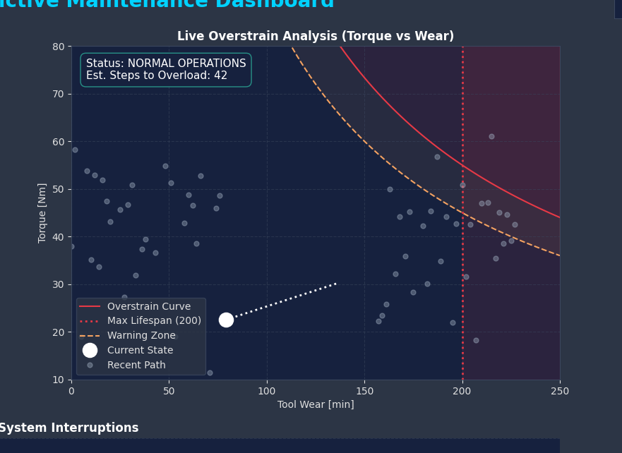
*   **Visual (UX/Layout):** Because the critical data (the failure curve) occupies the entire right side of the chart, the HUD is intentionally anchored to the top-left to avoid obscuring the most important visual information.
*   **Functional (Data Logic):** 
    *   The **Overstrain Curve** plots the exact mathematical threshold where the tool will snap due to excessive force. 
    *   The **Warning Zone** acts as an early-warning tripwire. 
    *   The **Current State** (large white dot) shows exactly where the machine is now, leaving a trail of **Recent Path** (grey dots) to show historical movement.

### 🪞 Brushed Data (Wear x Overstrain)
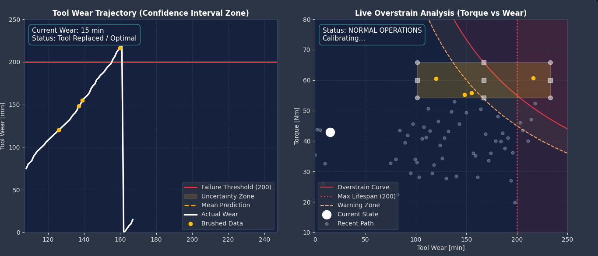
*   **Vizual (UX/Layout):** To know its the same data you select, the selection and the reflection on the Wear chart are the same color.
*   **Functional (Data Logic):** Allows operators to find potential patterns by looking at both perspectives of same data.

### 📊 Historical Interruptions
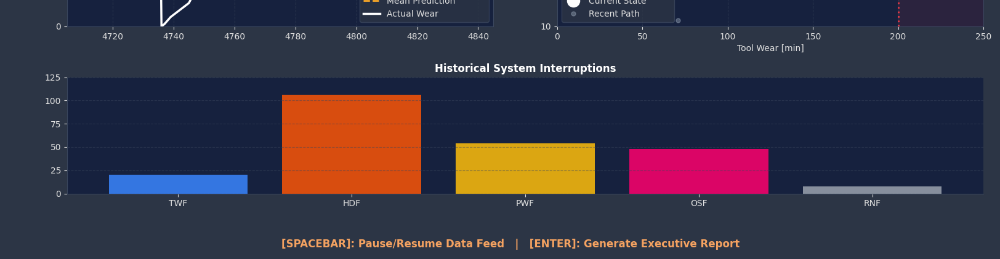
*   **Visual (UX/Layout):** Using the distinct categorical color palette discussed above. Because the chart is wide, faint horizontal gridlines are essential to help the eye track the bar height to the Y-axis.
*   **Functional (Data Logic):** Allows operators to quickly spot anomalies. If a specific error (like Power Faults) happens unusually often, the operator can notice the trend immediately without having to stop the machine and generate a full summary report.

---

## 📋 View 2: Executive Summary
The Executive Summary is a static, printable report generated on demand. It provides a deep dive into the machine's health, history, and status.

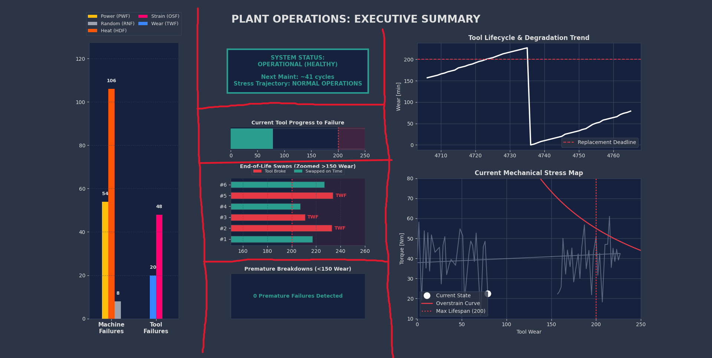

It is divided into 6 distinct analytical areas:
1. **Historical Failures:** Grouped bar chart of past breakdowns.
2. **Current Status:** A quick-read text block dictating immediate required actions.
3. **Current Tool Progress:** A simplified visual loading bar of tool wear.
4. **End-of-Life Swaps:** A zoomed-in historical view of the last 6 tool swaps.
5. **Premature Breakdowns:** A tracker for rare, early failures (<150 min wear).
6. **Deep Dive Viz:** Clean, static versions of the Wear and Overstrain charts for formal reference.

### 📊 Historical Failures (Grouped)
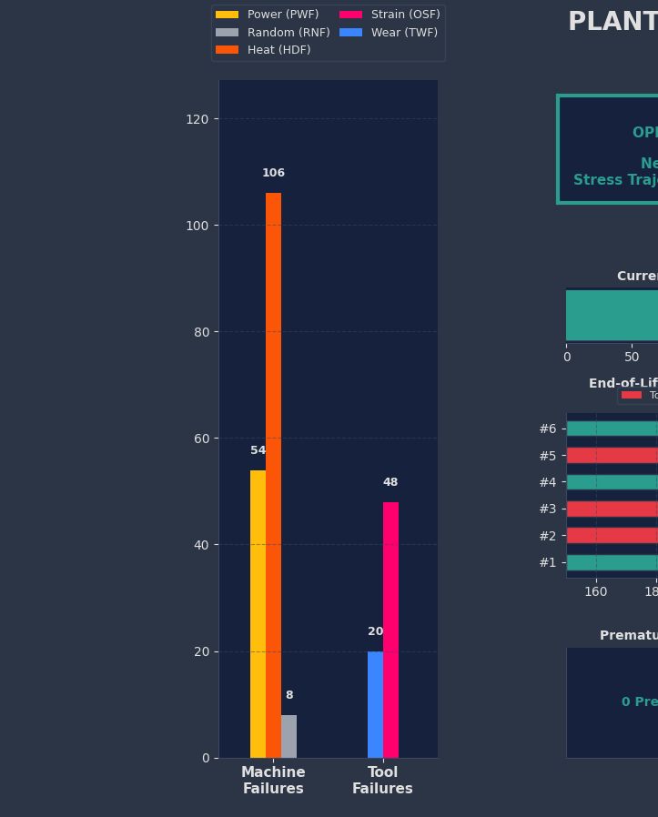
*   **Visual (UX/Layout):** The chart dynamically scales based on the tallest column. The legend is pushed to the absolute top of the chart to clear space, and is ordered to perfectly align with the columns below it. Each bar features an exact numerical label for precise reporting.
*   **Functional (Data Logic):** Instead of raw tracking, failures are logically grouped into **Machine Failures** (Power, Temp, Random) and **Tool Failures** (Wear, Strain). This allows management to instantly diagnose whether they have an electrical/environmental problem or a mechanical tooling problem.

### 🚦 Current Status
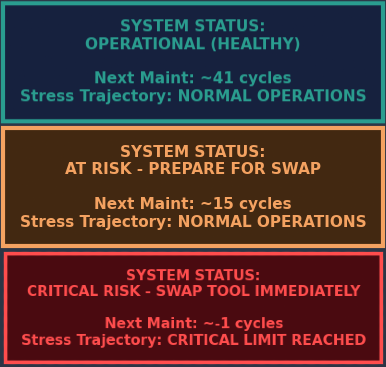
*   **Visual & Functional:** This is the highest-priority element on the board. Designed for supervisors who only have 5 seconds to read the report. It dynamically changes text and background color (Green ➔ Yellow ➔ Red) depending on the severity of the situation, instantly communicating if a swap needs to be done immediately.

### ⏳ Current Tool Progress
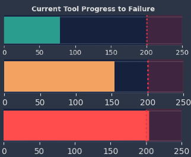
*   **Visual & Functional:** A simplified abstraction of the complex charts. It acts as a "loading bar." Once the tool passes the 150-minute mark, the bar turns Yellow. Once it crosses the 200-minute mark, it turns Red, signaling an immediate required swap.

### 🔄 End-of-Life Swaps
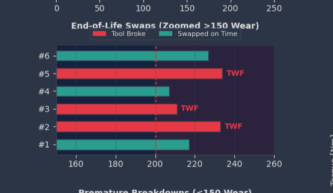
*   **Visual & Functional:** This chart acts as a magnifying glass, zooming in *only* on the 150–260 minute mark where critical maintenance occurs. 
    *   A **Green Bar** proves a successful, proactive swap before failure.
    *   A **Red Bar** indicates a reactive swap (the tool broke), explicitly labeling which failure type caused the breakdown.
